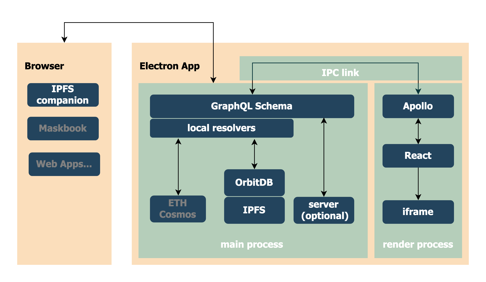

# Hypha Desktop

Hypha is an Electron app powered by InterPlanetary File System (IPFS). This project is still experimental and under heavy development. So, there might be some dragons 🐉.


## How to run dev environment up

```
npm run start:dev
```

## How to build

```
npm build
```

## Architecture



## Project structure

- [assets](src): Currently, icons and compiled web UI components will be placed here.

- [media](media): Screen shots and other materials are in this folder.

- [src](src): Electron and IPFS scripts are in this directory.

- [ui](ui): All web UI components reside in this folder.

## Rough road map

- stage 1: PoC with Electron.js on top of go-ipfs, similar with [ipfs-desktop](https://github.com/ipfs-shipyard/ipfs-desktop). Able to render HTML/CSS/JS documents from IPFS hash and IPNS, using Wikipedia, [China Digital Times](https://chinadigitaltimes.net) and [Matters News](https://matters.news) as starting point. Determine what are the basic information and controls users needed to debug and use IPFS node.

- stage 2: User can publish an article from application, and can follow another user’s publication timeline given the node id. User can also refer to other articles in their articles, to increase the exposure of related contents and redundencies in the network. User can also choose an optional server to keep their data when they are off line.

- stage 4: User can enable optional Tor integration for increase anonymity. Users can also send private messages to another user, which will be encrypted by the local private keys of both parties.

- stage 5: Simple integration of cryptocurrency payment, allowing users to support the writer and content they appreciate, either by donation or by crowdsourcing. The cryptocurrency we plan to integrate is Likecoin, which is suitable for micropayment in content, and Bitcoin, which is most widely used.
